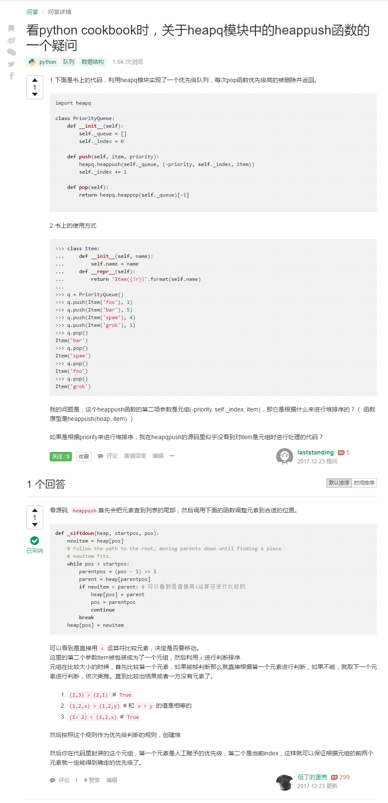

> 总结自[《python3-cookbook》](https://python3-cookbook.readthedocs.io/zh_CN/latest/index.html)

#### 数据结构与算法

##### 解压序列赋值给多个变量

-  任何的序列（或者是可迭代对象）可以通过一个简单的赋值语句解压并赋值给多个变量。 唯一的前提就是变量的数量必须跟序列元素的数量是一样的

- 解压赋值可以用在任何可迭代对象上面，而不仅仅是列表或者元组。 包括字符串，文件对象，迭代器和生成器

- 部分解压，使用任意变量名占位

- 示例

  ```python
  # 01
  data = [ 'ACME', 50, 91.1, (2012, 12, 21) ]
  name, shares, price, date = data
  date  # (2012, 12, 21)
  # 02
  name, shares, price, (year, mon, day) = data
  year  # 2012
  day  # 21
  # 03
  s = 'Hello'
  a, b, c, d, e = s
  a  # 'H'
  # 04
  data = [ 'ACME', 50, 91.1, (2012, 12, 21) ]
  _, shares, price, _ = data
  shares  # 50
  price  # 91.1
  ```

##### 解压可迭代对象赋值给多个变量

-  星号表达式(星号解压语法)解决`ValueError`

- 扩展的迭代解压语法是专门为解压不确定个数或任意个数元素的可迭代对象而设计的。 通常，这些可迭代对象的元素结构有确定的规则（比如第 1 个元素后面都是电话号码）， 星号表达式让开发人员可以很容易的利用这些规则来解压出元素来。 而不是通过一些比较复杂的手段去获取这些关联的元素值

- 示例

  ```python
  record = ('Dave', 'dave@example.com', '773-555-1212', '847-555-1212')
  name, email, *phone_numbers = record
  name  # 'Dave'
  email  # 'dave@example.com'
  phone_numbers  # ['773-555-1212', '847-555-1212']
  # 可变长元组的序列
  records = [
      ('foo', 1, 2),
      ('bar', 'hello'),
      ('foo', 3, 4),
  ]
  
  def do_foo(x, y):
      print('foo', x, y)
  
  def do_bar(s):
      print('bar', s)
  
  for tag, *args in records:
      if tag == 'foo':
          do_foo(*args)
      elif tag == 'bar':
          do_bar(*args)
  # 字符串操作
  line = 'nobody:*:-2:-2:Unprivileged User:/var/empty:/usr/bin/false'
  uname, *fields, homedir, sh = line.split(':')
  uname  # 'nobody'
  homedir  # '/var/empty'
  sh  # '/usr/bin/false'
  # 部分解压
  record = ('ACME', 50, 123.45, (12, 18, 2012))
  name, *_, (*_, year) = record
  name  # 'ACME'
  year  # 2012
  # 分割列表
  items = [1, 10, 7, 4, 5, 9]
  head, *tail = items
  head  # 1
  tail  # [10, 7, 4, 5, 9]
  # 递归（不建议）
  def sum(items):
       head, *tail = items
       return head + sum(tail) if tail else head
  
  sum(items)  # 36
  
  ```

##### 保留最后 N 个元素

-  使用 `collections.deque(maxlen=N)` 构造函数会新建一个固定大小的队列。当新的元素加入并且这个队列已满的时候， 最老的元素会自动被移除掉

- 一般的， `deque` 类可以被用在任何你只需要一个简单队列数据结构的场合。 如果你不设置最大队列大小，那么就会得到一个无限大小队列，你可以在队列的两端执行添加和弹出元素的操作

- 在队列两端插入或删除元素时间复杂度都是 `O(1)` ，区别于列表，在列表的开头插入或删除元素的时间复杂度为 `O(N)` 

- 示例

  ```python
  # 基本操作
  q = deque(maxlen=3)
  q.append(1)
  q.append(2)
  q.append(3)
  q  # deque([1, 2, 3], maxlen=3)
  q.append(4)
  q  # deque([2, 3, 4], maxlen=3)
  q.appendleft(4)  # deque([4，2, 3], maxlen=3)
  q.pop()  # 3
  q.popleft()  # deque([2], maxlen=3)
  ```

##### 查找最大或最小的 N 个元素

- `heapq 模块`有两个函数：`nlargest()` 和 `nsmallest()` 可以完美解决

- 两个函数都能接受一个关键字参数，用于更复杂的数据结构中

  ```python
  import heapq
  nums = [1, 8, 2, 23, 7, -4, 18, 23, 42, 37, 2]
  print(heapq.nlargest(3, nums)) # Prints [42, 37, 23]
  print(heapq.nsmallest(3, nums)) # Prints [-4, 1, 2]
  
  portfolio = [
      {'name': 'IBM', 'shares': 100, 'price': 91.1},
      {'name': 'AAPL', 'shares': 50, 'price': 543.22},
      {'name': 'FB', 'shares': 200, 'price': 21.09},
      {'name': 'HPQ', 'shares': 35, 'price': 31.75},
      {'name': 'YHOO', 'shares': 45, 'price': 16.35},
      {'name': 'ACME', 'shares': 75, 'price': 115.65}
  ]
  cheap = heapq.nsmallest(3, portfolio, key=lambda s: s['price'])
  expensive = heapq.nlargest(3, portfolio, key=lambda s: s['price'])
  ```

- 在一个集合中查找最小或最大的 N 个元素，并且 N 小于集合元素数量，那么这些函数提供了很好的性能。
  因为在底层实现里面，首先会先将集合数据进行堆排序后放入一个列表中

  ```python
  nums = [1, 8, 2, 23, 7, -4, 18, 23, 42, 37, 2]
  import heapq
  heap = list(nums)
  heapq.heapify(heap)
  heap  # [-4, 2, 1, 23, 7, 2, 18, 23, 42, 37, 8]
  ```

- 堆数据结构最重要的特征是 `heap[0]` 永远是最小的元素。并且剩余的元素可以很容易的通过调用 `heapq.heappop()` 方法得到，该方法会先将第一个元素弹出来，然后用下一个最小的元素来取代被弹出元素（这种操作时间复杂度仅仅是 O(log N)，N 是堆大小）

- **当要查找的元素个数相对比较小的时候，函数 `nlargest()` 和 `nsmallest()` 是很合适的。**
  **如果你仅仅想查找唯一的最小或最大（N=1）的元素的话，那么使用 `min()` 和 `max()` 函数会更快些。**
  **类似的，如果 N 的大小和集合大小接近的时候，通常先排序这个集合然后再使用切片操作会更快点**
  **（ `sorted(items)[:N]` 或者是 `sorted(items)[-N:]` ）。需要在正确场合使用函数 `nlargest()` 和 `nsmallest()` 才能发挥它们的优势（如果 N 快接近集合大小了，那么使用排序操作会更好些）**

  ```python
  # -*- coding: utf-8 -*-
  import heapq
  
  '''
      https://docs.python.org/3.7/library/heapq.html
  '''
  # heap[0] is the smallest item, and heap.sort() maintains the heap invariant!
  
  list_0 = [9, 3, 4, -1, 8, 12]
  list_1 = [6, 8, 1, 15]
  print('list_0: ', list_0)
  
  # heapify(x)
  heapq.heapify(list_0)
  print('heapify 》 list_0: ', list_0)
  
  # heappush(heap, item)
  heapq.heappush(list_0, 0)
  print('heappush 0 》 list_0:', list_0)
  heapq.heappush(list_0, 11)
  print('heappush 11 》 list_0:', list_0)
  
  # heappop(heap)
  heapq.heappop(list_0)
  print('heappop 》 list_0:', list_0)
  heapq.heappop(list_0)
  print('heappop 》 list_0:', list_0)
  
  # heappushpop(heap, item)
  heapq.heappushpop(list_0, 8)
  print('heappushpop 8 》 list_0:', list_0)
  
  # heapreplace(heap, item)
  heapq.heapreplace(list_0, 5)
  print('heapreplace 5 》 list_0:', list_0)
  
  # merge(*iterables, key=None, reverse=False
  heapq.heapify(list_0)
  heapq.heapify(list_1)
  list_2 = heapq.merge(list_0, list_1, key=None, reverse=False)
  print(list_0)
  print(list_1)
  print(list_2)
  merge_a, *merge_b = list_2
  print('merge_a + *merge_b: ', (merge_a, *merge_b))
  
  # nlargest(n, iterable, key=None)/nsmallest(n, iterable, key=None)
  list_3 = list((merge_a, *merge_b))
  print(heapq.nsmallest(3, list_3, key=None))
  print(heapq.nlargest(3, list_3, key=None))
  ```

##### 实现一个优先级队列

-  利用 `heapq` 模块实现了一个简单的优先级队列

  ```
  # -*- coding: utf-8 -*-
  
  import heapq
  
  
  class PriorityQueue:
      # 初始化
      def __init__(self):
          self._queue = []
          self._index = 0
  
      # heappush首先会把元素查到列表的尾部，然后调用下面的函数调整元素到合适的位置
      # 元组在比较大小的时候，首先比较第一个元素，如果能够判断那么就直接根据第一个元素进行判断
      # 如果不能，就取下一个元素进行判断，依次类推。直到比较出结果或者一方没有元素了。
      def push(self, item, priority):
          # 把值加入堆中，（-priority, self._index, item）
          heapq.heappush(self._queue, (-priority, self._index, item))
          self._index += 1
  
      def pop(self):
          # 返回（弹出）堆中最小值[-1]
          return heapq.heappop(self._queue)[-1]
  
  
  # ！符号，这个只在format中有用
  # 'Item({!r})'.format(self.name) 等价于 'Item(%r) % self.name'
  class Item:
      def __init__(self, name):
          self.name = name
  
      def __repr__(self):
          return 'Item({!r})'.format(self.name)
  
  
  q = PriorityQueue()
  q.push(Item('foo'), 1)  # [(-1, 1, Item('foo')]
  q.push(Item('bar'), 5)  # [(-5, 0, Item('bar')), (-1, 1, Item('foo'))]
  q.push(Item('spam'), 4)  # [(-5, 0, Item('bar')), (-1, 1, Item('foo')), (-4, 2, Item('spam'))]
  q.push(Item('grok'), 1)  # [(-5, 0, Item('bar')), (-1, 1, Item('foo')), (-4, 2, Item('spam')), (-1, 3, Item('grok'))]
  print('q.pop() > 5', q.pop())  # q.pop() > 5 Item('bar')
  print('q.pop() > 4: ', q.pop())  # q.pop() > 4:  Item('spam')
  print('q.pop() > 1: ', q.pop())  # q.pop() > 1:  Item('foo')
  print('q.pop() > 1: ', q.pop())  # q.pop() > 1:  Item('grok')
  ```

- 函数 `heapq.heappush()` 和 `heapq.heappop()` 分别在队列 `_queue` 上插入和删除第一个元素，
  并且队列 `_queue` 保证第一个元素拥有最高优先级

- 队列包含了一个 `(-priority, index, item)` 的元组。优先级为负数的目的是使得元素按照优先级从高到低排序。这个跟普通的按优先级从低到高排序的堆排序恰巧相反

- `index` 变量的作用是保证同等优先级元素的正确排序

- 

